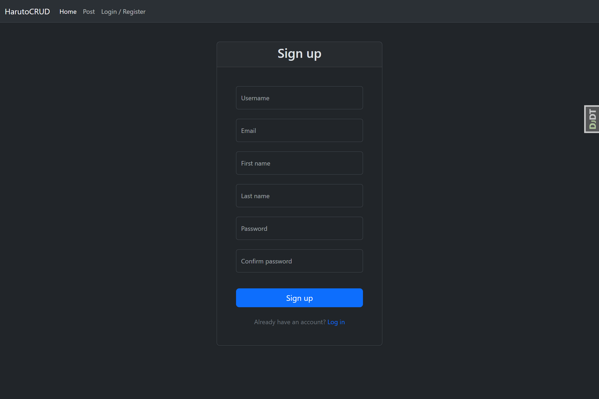
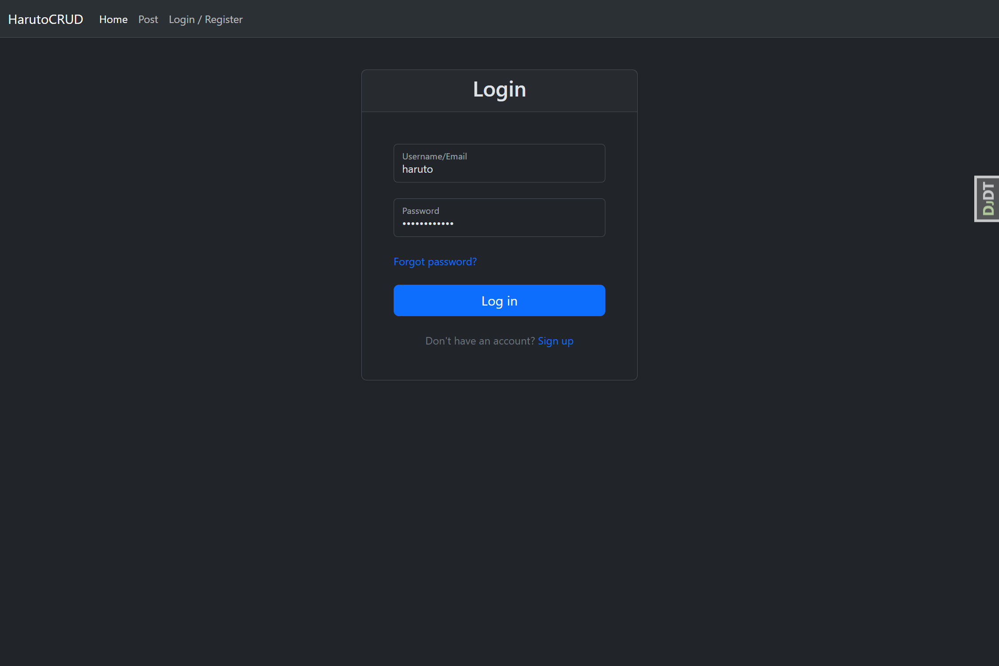

# HarutoCRUD

## Overview

A simple CRUD application that allows users to post articles in Markdown format. Built mainly to explore Django’s function-based views (FBV), with a focus on backend design and logic. The frontend is kept minimal to highlight backend implementation.

## Features

-   User registration and authentication using a custom user model
-   Login and logout functionality
-   Password reset flow (reset → email → update)
-   View, edit, and delete user profiles
-   Create, update, and delete articles
-   Write articles in Markdown format
-   Live preview while editing articles in Markdown
-   Full-text filtering by article title and content
-   Sort articles by date (ascending/descending)
-   Drag-and-drop image upload with automatic Markdown insertion via Ajax
-   Pagination for article listing
-   Secure design to block unauthenticated requests
-   Unit tests for models, forms, and views
-   Success and error messages for user actions (e.g., registration, login, posting)

## Tech Stack

-   **Backend**: Django 5.1, django-filter, django-environ
-   **Frontend**: HTML, CSS, JavaScript
-   **UI**: Bootstrap 5.3.6, django-widget-tweaks
-   **Markdown**: Ace Editor, marked.js, highlight.js
-   **Testing**: pytest, pytest-django

## Getting Started

1. Clone the repository

```bash
git clone https://github.com/kikutan-day65/markdown_note.git
```

2. Create and activate a virtual environment

```bash
cd markdown_note
python -m venv venv
source venv/bin/activate
```

3. Install dependencies

```bash
pip install -r requirements.txt
```

4. Create a `.env` file (refer to `.env.example` for required variables)

```bash
touch .env
```

5. Apply database migrations

```bash
python manage.py makemigrations
python manage.py migrate
```

6. Start the development server

```bash
python manage.py runserver
```

## Screenshots






## License

This project is licensed under the MIT License.
