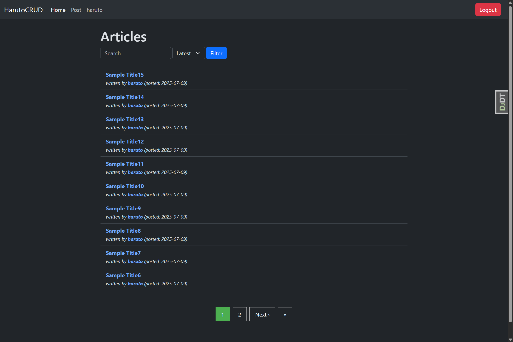
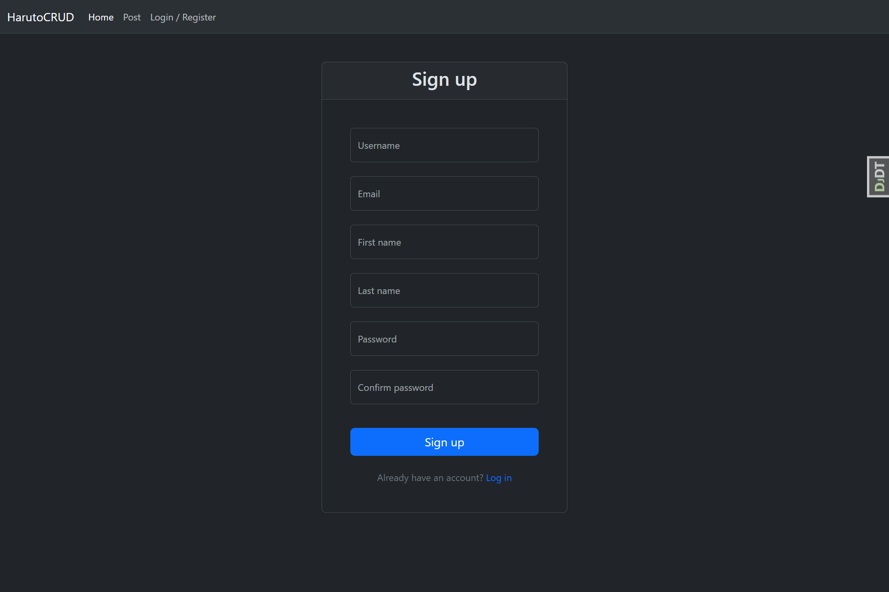
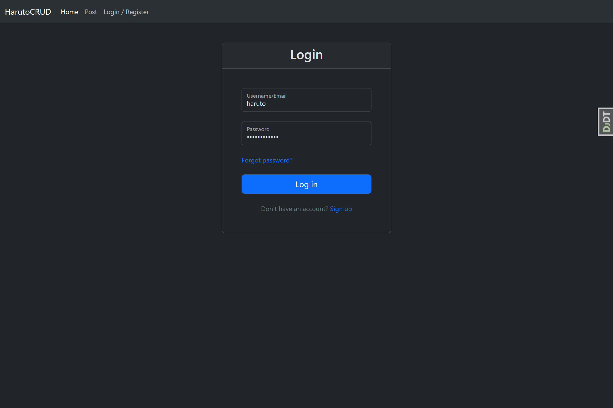
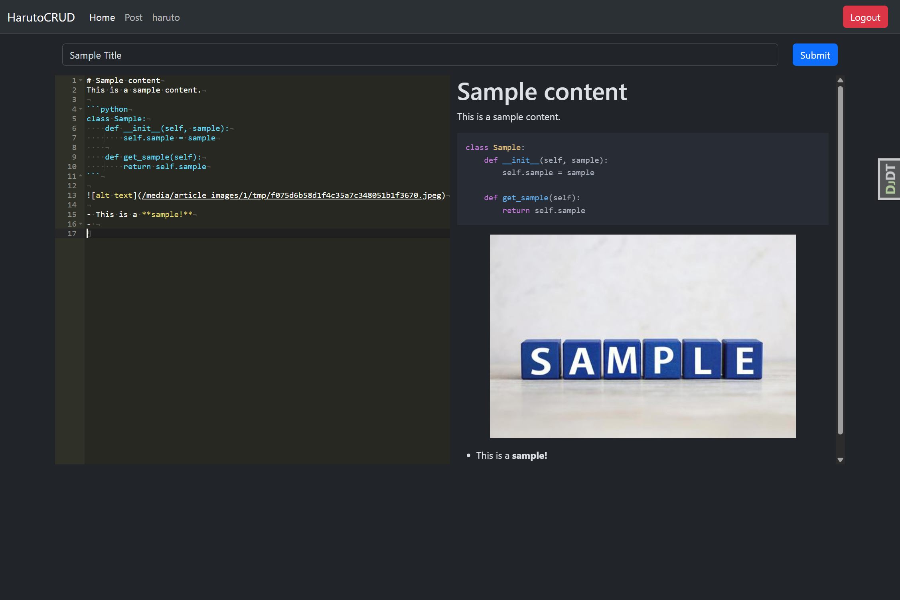
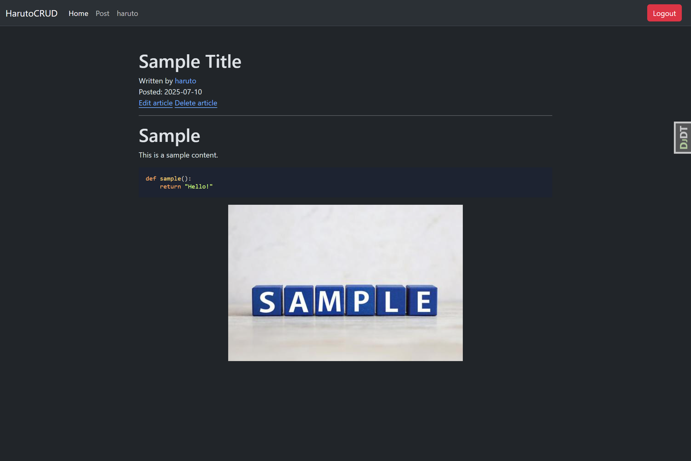

# HarutoCRUD

## Overview

Markdown 形式で記事投稿ができるシンプルな CURD アプリです。Django の FBV(関数ベースビュー)によるバックエンド構築を主な目的として開発しました。フロントエンドは必要最低限の実装にとどめ、主にバックエンドの設計と処理ロジックに注力しています。

## Features

-   カスタムユーザモデルを用いた登録と認証
-   ログイン・ログアウト機能
-   パスワードリセット（リセット → メール送信 → 再設定）
-   ユーザー情報の閲覧・編集・削除機能
-   記事の投稿・更新・削除機能
-   マークダウン形式での記事投稿
-   記事編集時のマークダウンライブプレビュー表示
-   投稿記事のタイトル・内容による全文フィルタリング
-   投稿順（昇順・降順）による記事の並び替え
-   ドラッグ＆ドロップ と Ajax によるマークダウンへの画像挿入
-   記事一覧のページネーション
-   未認証ユーザからのリクエストを防ぐセキュアな設計
-   モデル・フォーム・ビューに対するユニットテスト
-   ユーザー操作（登録・ログイン・投稿など）に対する成功・エラー時のメッセージ表示

## Tech Stack

-   **Backend**: Django 5.1, django-filter, django-environ
-   **Frontend**: HTML, CSS, JavaScript
-   **UI**: Bootstrap 5.3.6, django-widget-tweaks
-   **Markdown**: Ace Editor, marked.js, highlight.js
-   **Testing**: pytest, pytest-django

## Getting Started

1. リポジトリのクローン

```bash
git clone https://github.com/kikutan-day65/markdown_note.git
```

2. 仮想環境の作成と有効化

```bash
cd markdown_note
python -m venv venv
source venv/bin/activate
```

3. パッケージのインストール

```bash
pip install -r requirements.txt
```

4. `.env`ファイルの作成（内容は`.env.example`を参照）

```bash
touch .env
```

5. マイグレーションの実行

```bash
python manage.py makemigrations
python manage.py migrate
```

6. 開発サーバの起動

```bash
python manage.py runserver
```

## Screenshots







## License

This project is licensed under the MIT License.
